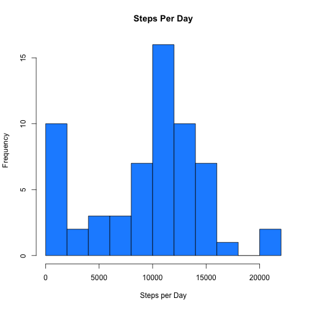
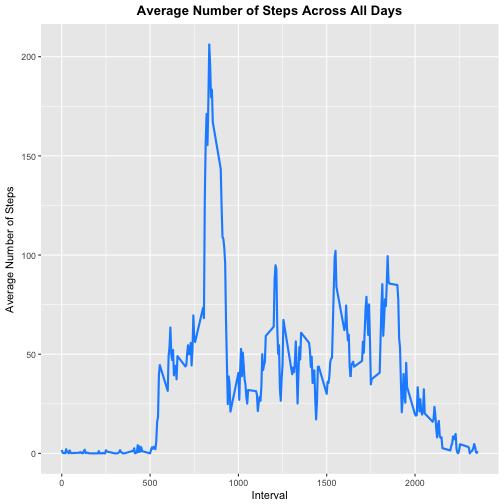
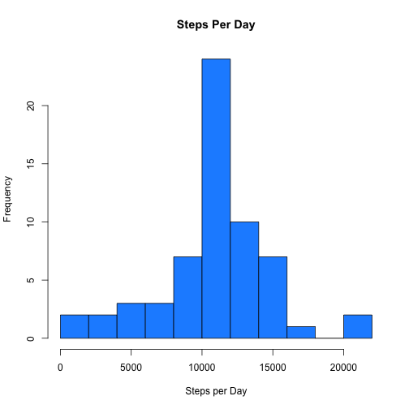
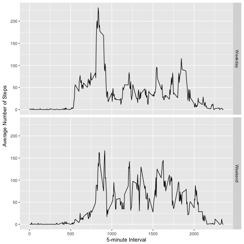

```r
library(dplyr)
library(ggplot2)
library(lubridate)
```

## Loading and preprocessing the data


```r
setwd("~/Desktop/Coursera/GitHub/RepData_PeerAssessment1")
activity <- read.csv("activity.csv")
```

***

## What is mean total number of steps taken per day?

The number of steps per day is logged in the 'steps' column of spd. There are many missing and 0 values in the data.

```r
spd <- summarize(group_by(activity, date), steps = sum(steps, na.rm = T))
head(spd)
```

```
## # A tibble: 6 × 2
##         date steps
##       <fctr> <int>
## 1 2012-10-01     0
## 2 2012-10-02   126
## 3 2012-10-03 11352
## 4 2012-10-04 12116
## 5 2012-10-05 13294
## 6 2012-10-06 15420
```

A histogram showing the total number of steps taken per day. 

```r
hist(spd$steps, breaks = 15, xlab = "Steps per Day", main = "Steps Per Day", col = "dodgerblue")
```



```r
summary(spd$steps)
```

```
##    Min. 1st Qu.  Median    Mean 3rd Qu.    Max. 
##       0    6778   10400    9354   12810   21190
```
The mean is 9354 steps per day and the median is 10400 steps per day. 

***

## What is the average daily activity pattern?


```r
avgsteps <- summarize(group_by(activity, interval), meansteps = mean(steps, na.rm = T))
```
A time series plot of the intervals and average number of steps taken across all days.

```r
ggplot(data = avgsteps, aes(interval, meansteps)) +
  geom_line(lwd = 1, color = "dodgerblue") +
  xlab("Interval") + 
  ylab("Average Number of Steps") +
  ggtitle("Average Number of Steps Across All Days") + 
  theme(plot.title = element_text(hjust = 0.5, face = "bold"))
```



```r
avgsteps[which(avgsteps$meansteps == max(avgsteps$meansteps)), ]
```

```
## # A tibble: 1 × 2
##   interval meansteps
##      <int>     <dbl>
## 1      835  206.1698
```
The interval 835 contains the maximum number of steps.

***

## Imputing missing values


```r
sum(is.na(activity$steps))
```

```
## [1] 2304
```
The total number of NAs in the steps column is 2304.

```r
sum(is.na(activity$interval))
```

```
## [1] 0
```
The total number of NAs in the interval column is 0.

```r
sum(is.na(activity$date))
```

```
## [1] 0
```
The total number of NAs in the date column is 0.

Replace the NA values in the data. I will replace each NA in the steps column with the average number of steps across all dates for the given interval. activityrm is the data without NAs.

```r
activityrm <- activity
for (i in 1:nrow(activity)){
  if (is.na(activity$steps[i])){
    activityrm$steps[i] <- avgsteps[which(avgsteps$interval == activity$interval[i]), 2]
  }
}
```
A histogram of the data without NAs. This shows the new Steps per day.

```r
activityrm$steps <- as.numeric(activityrm$steps)
spdrm <- summarize(group_by(activityrm, date), steps = sum(steps))
hist(spdrm$steps, breaks = 15, xlab = "Steps per Day", main = "Steps Per Day", col = "dodgerblue")
```



```r
summary(spdrm$steps)
```

```
##    Min. 1st Qu.  Median    Mean 3rd Qu.    Max. 
##      41    9819   10770   10770   12810   21190
```
The mean number of steps is the 10770 per day with missing values removed and the median number of steps is 10770 per day with missing values removed. The mean and median steps per day both have risen with the removal of the NA values. 

***

## Are there differences in activity patterns between weekdays and weekends?

Below a new column, class factor, labeling each day a weekday or weekend day.

```r
activityrm$day <- wday(activityrm$date)
activityrm$wkdy <- ifelse(activityrm$day == 7 | activityrm$day == 1, "Weekend", "Weekday")
activityrm$wkdy <- factor(activityrm$wkdy)
head(activityrm)
```

```
##       steps       date interval day    wkdy
## 1 1.7169811 2012-10-01        0   2 Weekday
## 2 0.3396226 2012-10-01        5   2 Weekday
## 3 0.1320755 2012-10-01       10   2 Weekday
## 4 0.1509434 2012-10-01       15   2 Weekday
## 5 0.0754717 2012-10-01       20   2 Weekday
## 6 2.0943396 2012-10-01       25   2 Weekday
```
Plot the intervals and average number of steps plotted for weekends and for weekday separately. 

```r
actrmavg <- aggregate(steps ~ interval + wkdy, data=activityrm, mean)
ggplot(actrmavg, aes(interval, steps)) + 
    geom_line() + 
    facet_grid(wkdy ~ .) +
    xlab("5-minute Interval") + 
    ylab("Average Number of Steps")
```



